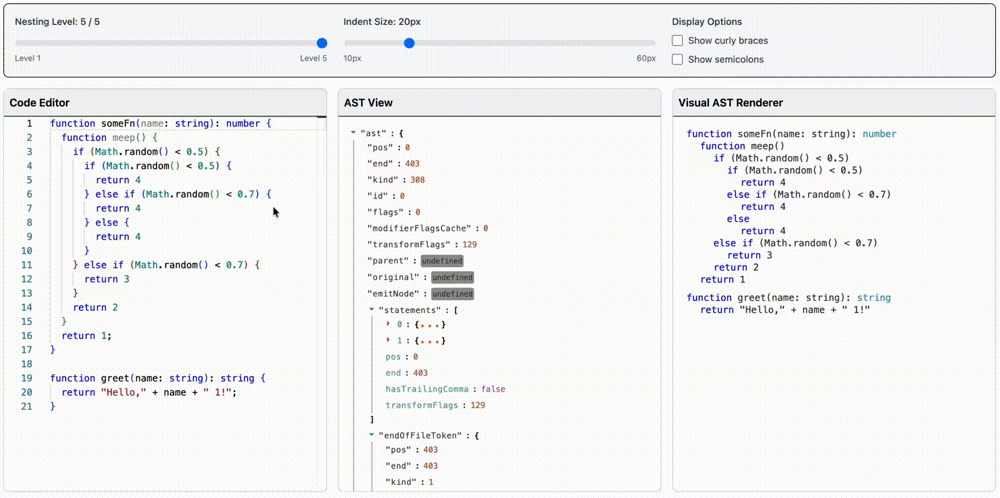
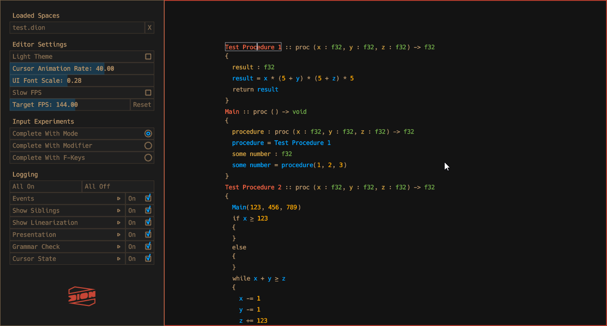

This project was directly inspired by Dion Systems - a custom-built code editor that works directly with the AST representation, for both editing and rendering.

Here we have a Monaco editor for users to input the [Typescript] source code. It then parses it and generates AST using `typescript` package. It then uses the generated AST to render things in the `<canvas>`.

This functionality is very basic and crude approximation of what the original Dion Systems was able to achieve. Still, this toy project served as a fun exploration on the topic of semantic zoom.

# Local dev

Project uses [`bun`](https://bun.com/).

```sh
bun i       # to install dependencies
bun run dev # to run locally
```

# More on Dion Systems



- https://github.com/4coder-archive/4coder
- https://handmade.network/snippet/251
- https://www.youtube.com/watch?v=bpni9rEU850
- https://vimeo.com/485177664
- https://www.youtube.com/watch?v=GB_oTjVVgDc
- https://web.archive.org/web/20220918192200/https://dion.systems/
- https://x.com/msimoni/status/1695076884269117469
- https://news.ycombinator.com/item?id=32372707